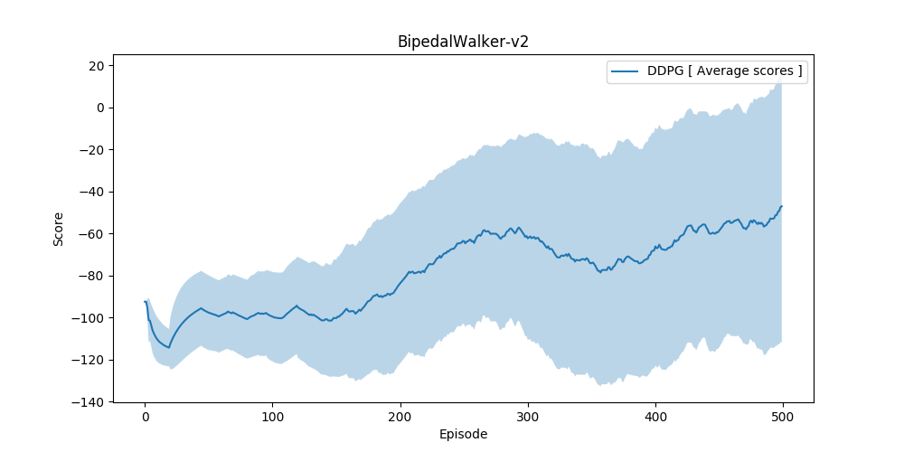

# OpenAI Gym's BipedalWalker environment

<p align="center">
    
</p>

## Environment setup

#### Clone the Repository
If you haven't already, please follow the [instructions](https://github.com/dganbold/deep_reinforcement_learning) to set up your Python environment.

## Usage

- Execute the following command to train the agent:

```
$ python train.py
```

- Execute the following command to test the pre-trained agent:

```
$ python test.py
```

## Result
After some hyperparameter tuning, environment solved in 500 episodes by [DDPG](https://github.com/dganbold/deep_reinforcement_learning/blob/master/DDPG/agent/DDPG.py) with [hyperparameters](https://github.com/dganbold/deep_reinforcement_learning/blob/master/DDPG/config/OpenAIGym_Box2d.py). [score history](https://github.com/dganbold/deep_reinforcement_learning/blob/master/DDPG/BipedalWalker/scores/BipedalWalker-v2_DDPG_5.0E-04_1.0E-03_512_5.0E-02_256.csv).<br />

<p align="center">
    
</p>
