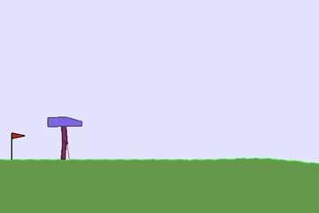

# Deep Deterministic Policy Gradient (DDPG)

## Description
In this project, implemented Deep Deterministic Policy Gradient(DDPG) algorithm based on following papers with [PyTorch](https://www.pytorch.org/) and applied to continuous control environment.

- [Continuous control with deep reinforcement learning](https://arxiv.org/abs/1509.02971)
- [Distributed Distributional Deterministic Policy Gradients](https://arxiv.org/abs/1804.08617)

## Background
Policy-based methods are well-suited for continuous action spaces but it has several drawbacks suck as evaluating policy is generally inefficient and high variance. The Actor-Critic methods reduce variance with respect to pure policy search methods. It uses function approximation to learn a policy(Actor) and a value function(Critic).

<p align="center">
    
</p>

## DDPG algorithm
The [DDPG](https://arxiv.org/abs/1509.02971) is off-policy Actor-Critic approach which combination of Policy learning method and Deep Q-Network(DQN). It maintains a parameterized actor function which specifies the current policy by deterministically mapping states to a specific action. The critic is learned using the Bellman equation as in Q-learning which evaluates the policy.

<p align="center">
    
</p>

## Result
<p align="center">
    <em>Unity Reacher environment, DDPG Learning curve.</em>
</p>
<p align="center">
    
</p>

<p align="center">
    <em>Unity Reacher environment, trained DDPG.</em>
</p>
<p align="center">
    
</p>

<p align="center">
    <em>OpenAI Gym's BipedalWalker environment, trained DDPG.</em>
</p>
<p align="center">
    
</p>

## Dependencies
- [Conda](https://conda.io/docs/user-guide/install/index.html)
- Python 3.6
- [PyTorch 0.4.0](http://pytorch.org/)
- [NumPy >= 1.11.0](http://www.numpy.org/)
- [OpenAI Gym](https://github.com/openai/gym)
- [Matplotlib](https://matplotlib.org/)
- [Pandas](https://pandas.pydata.org/)
- [SciPy](https://www.scipy.org/)

If you want to run the code in this repository, check this [instructions](https://github.com/dganbold/deep_reinforcement_learning).

## Supported environments

### OpenAI Gym

#### Classic Control
- [`Pendulum-v0`](https://github.com/dganbold/deep_reinforcement_learning/tree/master/DDPG/Pendulum) with DDPG

#### Box2d
- [`BipedalWalker-v2`](https://github.com/dganbold/deep_reinforcement_learning/tree/master/DDPG/BipedalWalker) with DDPG | solved in 500 episodes

### Unity
- [`Reacher`](https://github.com/dganbold/deep_reinforcement_learning/tree/master/DDPG/Reacher) with DDPG | solved in 147 episodes

## Usage

- Execute the following command to train the agent:

```
$ cd [Environment]
$ python train.py
```

- Execute the following command to test the pre-trained agent:

```
$ python test.py
```

## Future work
- Implement a Distributed Distributional Deterministic Policy Gradients (D4PG) [[arxiv]](https://arxiv.org/abs/1804.08617)
