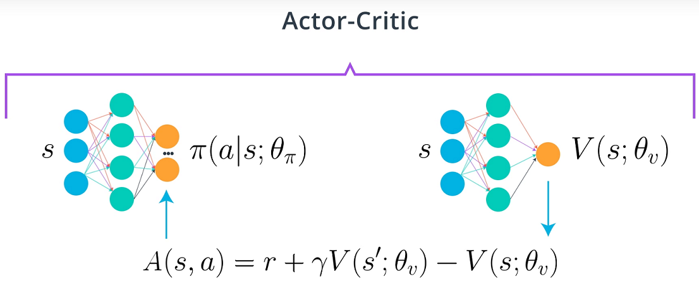

# Project 2: Continuous Control

    

# Description
In this project, implemented Deep Deterministic Policy Gradient (DDPG) algorithm based on following papers with [PyTorch](https://www.pytorch.org/) and applied to continuous control environment, where the goal is agent is to maintain its position at the target location for as many time steps as possible.

- [Continuous control with deep reinforcement learning](https://arxiv.org/abs/1509.02971)
- [Distributed Distributional Deterministic Policy Gradients](https://arxiv.org/abs/1804.08617)

## Environment
In this environment, a double-jointed arm can move to target locations. A reward of +0.1 is provided for each step that the agent's hand is in the goal location. Thus, the goal of the agent is to maintain its position at the target location for as many time steps as possible.

The observation space consists of 33 variables corresponding to position, rotation, velocity, and angular velocities of the arm. Each action is a vector with four numbers, corresponding to torque applicable to two joints. Every entry in the action vector should be a number between -1 and 1.

The task is episodic, and in order to solve the environment, agent must get an average score of +30 over 100 consecutive episodes.

# Background
Policy-based methods are well-suited for continuous action spaces but it has several drawbacks suck as evaluating policy is generally inefficient and high variance. The Actor-Critic methods reduce variance with respect to pure policy search methods. It uses function approximation to learn a policy(Actor) and a value function(Critic).

    

## DDPG algorithm
The [DDPG](https://arxiv.org/abs/1509.02971) is off-policy Actor-Critic approach which combination of Policy learning method and Deep Q-Network(DQN). It maintains a parameterized actor function which specifies the current policy by deterministically mapping states to a specific action. The critic is learned using the Bellman equation as in Q-learning which evaluates the policy.

    

Some other interesting aspects of the DDPG are shown below.

    

# Implementation
The baseline code from [Deep Reinforcement Learning nanodegree course's GitHub](https://github.com/udacity/deep-reinforcement-learning/tree/master/ddpg-bipedal) which intended for solving OpenAI gym's BipedalWalker-v2 problem.
In this project, Agent is modified to interact with Unity's [Reacher](https://github.com/Unity-Technologies/ml-agents/blob/master/docs/Learning-Environment-Examples.md#reacher) environment and hyperparameters are tuned.

## Hyperparameter tuning
Bayesian Optimization based software framework [Optuna](https://optuna.org/) is used it as hyperparameter tuning.

### Attempt 1
The best performance of certain parameter configuration will be reach 10 (average cumulative reward) over 400 episodes but
environment is not solved yet.
Detailed implementation of the hyperparameter tuning can be found in hyperparameter_tuning.py file.

    

### Attempt 2
To use Ornstein-Uhlenbeck noise which sampled from Normal Distribution instead of Uniform in exploration.   
Reference code from [https://github.com/floodsung/DDPG/blob/master/ou_noise.py]

    

### Attempt 3
To use some weight decay in critic optimizer.

    

# Result
The environment is solved in 47 episodes by [DDPG](https://github.com/dganbold/deep_reinforcement_learning/blob/master/DDPG/agent/DDPG.py) with [hyperparameters](https://github.com/dganbold/deep_reinforcement_learning/blob/master/DDPG/config/UnityML_Agent.py). [[score history]](../scores/Reacher_DDPG_1.0E-04_1.0E-04_256_1.0E-03_128.csv).

    

# Future work
- Distributed Distributional Deterministic Policy Gradients [[arxiv]](https://arxiv.org/abs/1804.08617)
- Parameter Space Noise for Exploration [[arxiv]](https://arxiv.org/abs/1706.01905)
