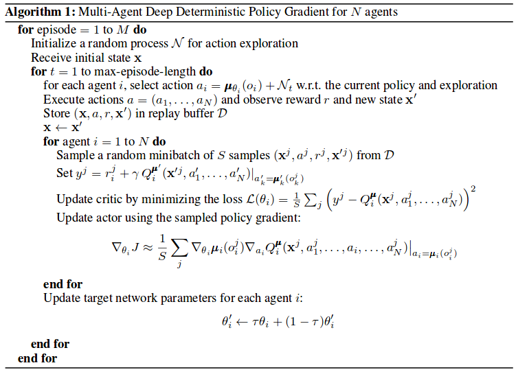

# Multi-Agent Deep Deterministic Policy Gradient

## Description
In this project, implemented Multi-Agent Deep Deterministic Policy Gradient (MADDPG) algorithm based on following papers with [PyTorch](https://www.pytorch.org/) and applied to multi-agent continuous control environment.

- Continuous control with deep reinforcement learning [[arxiv]](https://arxiv.org/abs/1509.02971)
- Multi-Agent Actor-Critic for Mixed Cooperative-Competitive Environments [[arxiv]](https://arxiv.org/abs/1706.02275)
- Multi-Agent Reinforcement Learning [[arxiv]](https://arxiv.org/abs/1807.09427)

## Background
The formal model of single-agent RL is the Markov decision process (MDP).
The agent selects actions and the environment responds by giving a reward and new state. A canonical view of the this interaction between agent and environment is shown below.

<p align="center">
    
</p>
<p align="center">
    <em>The agent-environment interaction in reinforcement learning. (Source: Sutton and Barto, 2017)</em>
</p>

The multi-agent extention of MDPs called partially observable Markov games
[[Markov games as a framework for multi-agent reinforcement learning]](https://www.google.com/url?sa=t&rct=j&q=&esrc=s&source=web&cd=1&ved=2ahUKEwjYwpTgnaLfAhXNc94KHUVGA5YQFjAAegQIBhAC&url=https%3A%2F%2Fwww2.cs.duke.edu%2Fcourses%2Fspring07%2Fcps296.3%2Flittman94markov.pdf&usg=AOvVaw3Z8842P_QFvL9BePhnSKUY) by Littman, Michael L. ICML, 1994.<br />
A Markov game for N agents defined by a set of states describing the possible configurations of all agents, a set of action and a set of observations for each agent. In the multi-agent case, the state transitions and rewards are the result of the joint action of all the agents.

<p align="center">
    
</p>
<p align="center">
    <em>The multi-agent environment interaction.</em>
</p>

The most simple approach to learning in multi-agent setting is
to use decentralized agents which independently learning policy or action-value function. However both methods does not perform well in this context.
One issue is that agent’s policy changes during training, resulting in a non-stationary environment and preventing the naive application of experience replay according to the [[Multi-Agent Actor-Critic for Mixed Cooperative-Competitive]](https://arxiv.org/abs/1706.02275).

### Multi-Agent Actor Critic
Recent approaches to solve the learning problem in multi-agent settings is ``Decentralized Actor, Centralized Critic``. The core idea behind this paradigm is centralized critic provides an indirect observation of the complete global state to each of the actors.

### MADDPG algorithm
[Multi-Agent Deep Deterministic Policy Gradient (MADDPG)](https://arxiv.org/abs/1706.02275) is ``Decentralized Actor, Centralized Critic`` approach adapting the [DDPG](https://arxiv.org/abs/1509.02971) to use in multi-agent setting. The centralized action-value function that takes as input the actions and observations of all agents and the decentralized actor acts based on only its own observation. <br />
More concretely, two agents case of the MADDPG is illustrated below:

<p align="center">
    
</p>
<p align="center">
    <em>Overview of Two-Agent Deep Deterministic Policy Gradient (MADDPG).</em>
</p>

Some other interesting aspect of the MADDPG is all agents shares a replay buffer which holds
all observations, rewards and joint actions. <br />
 Below image illustrates full MADDPG algorithm:

 <p align="center">
     
 </p>

 ## Result
 
 <p align="center">
     <em>Unity Tennis environment, trained MADDPG.</em>
 </p>
 <p align="center">
     
 </p>


 ## Dependencies
 - [Conda](https://conda.io/docs/user-guide/install/index.html)
 - Python 3.6
 - [PyTorch 0.4.0](http://pytorch.org/)
 - [NumPy >= 1.11.0](http://www.numpy.org/)
 - [OpenAI Gym](https://github.com/openai/gym)
 - [Matplotlib](https://matplotlib.org/)
 - [Pandas](https://pandas.pydata.org/)
 - [SciPy](https://www.scipy.org/)

 If you want to run the code in this repository, check this [instructions](https://github.com/dganbold/deep_reinforcement_learning).

## Supported environments

### Unity
- [`Tennis`](https://github.com/dganbold/deep_reinforcement_learning/tree/master/MADDPG/Tennis) with MADDPG | solved in 427 episodes

## Usage

- Execute the following command to train the agent:

```
$ cd [Environment]
$ python train.py
```

- Execute the following command to test the pre-trained agent:

```
$ python test.py
```
