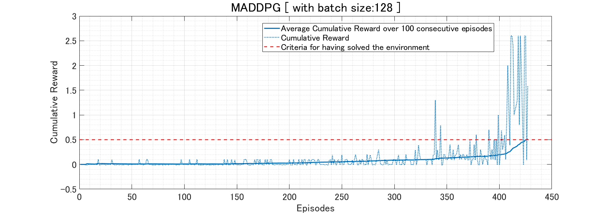

# Tennis

<p align="center">
    
</p>

## Description
In this [environment](https://github.com/Unity-Technologies/ml-agents/blob/master/docs/Learning-Environment-Examples.md#tennis), two agents control rackets to bounce a ball over a net. If an agent hits the ball over the net, it receives a reward of +0.1.  If an agent lets a ball hit the ground or hits the ball out of bounds, it receives a reward of -0.01.  Thus, the goal of each agent is to keep the ball in play.

The observation space consists of 8 variables corresponding to the position and velocity of the ball and racket. Each agent receives its own, local observation.  Two continuous actions are available, corresponding to movement toward (or away from) the net, and jumping.

The task is episodic, and in order to solve the environment, agents must get an average score of +0.5 (over 100 consecutive episodes, after taking the maximum over both agents).

## Environment setup (for Linux)

#### Step 1: Clone the Repository
If you haven't already, please follow the [instructions](https://github.com/dganbold/deep_reinforcement_learning) to set up your Python environment.

#### Step 2: Download the Unity Environment
Download pre-built environment for Linux from one of the [links](https://s3-us-west-1.amazonaws.com/udacity-drlnd/P3/Tennis/Tennis_Linux.zip).<br />
Then, place the file in the DDPG/Reacher/ folder in the cloned Repository, and decompress the file.<br />

```
$ cp Tennis_Linux.zip MADDPG/Tennis/
$ cd MADDPG/Tennis/
$ unzip Tennis_Linux.zip
```

Next, make sure the file_name parameter in train.py and test.py to match the binary file name of the Unity environment that you downloaded.
- Linux (x86): "Tennis_Linux/Tennis.x86"
- Linux (x86_64): "Tennis_Linux/Tennis.x86_64"

## State space
The observation space consists of 8 variables corresponding to the position and velocity of the ball and racket. Each agent receives its own, local observation.  

## Action space
Two continuous actions are available, corresponding to movement toward (or away from) the net, and jumping.

## Reward
If an agent hits the ball over the net, it receives a reward of +0.1.  If an agent lets a ball hit the ground or hits the ball out of bounds, it receives a reward of -0.01.

## Usage

- Execute the following command to train the agent:

```
$ python train.py
```

- Execute the following command to test the pre-trained agent:

```
$ python test.py
```

# Result
The environment is solved in 427 episodes by [MADDPG](https://github.com/dganbold/deep_reinforcement_learning/blob/master/MADDPG/agent/MADDPG.py) with [hyperparameters](https://github.com/dganbold/deep_reinforcement_learning/blob/master/MADDPG/config/UnityML_Agent.py). [[score history]](scores/Tennis_MADDPG_1.0E-03_1.0E-03_256_4.3E-02_128.csv).<br />
See the detailed project report from [Report.md](./docs/Report.md) file.
<p align="center">
    
</p>
