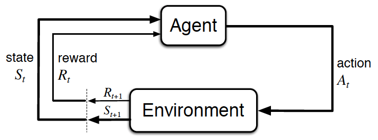

# Project 3: Collaboration and Competition

    

## Description
In this project, implemented Multi-Agent Deep Deterministic Policy Gradient (MADDPG) algorithm based on following papers with [PyTorch](https://www.pytorch.org/) and applied to multi-agent continuous control environment, where the goal is each agent is to keep the ball in play.

- Continuous control with deep reinforcement learning [[arxiv]](https://arxiv.org/abs/1509.02971)
- Multi-Agent Actor-Critic for Mixed Cooperative-Competitive Environments [[arxiv]](https://arxiv.org/abs/1706.02275)
- Multi-Agent Reinforcement Learning [[arxiv]](https://arxiv.org/abs/1807.09427)

## Environment
In this environment, two agents control rackets to bounce a ball over a net. If an agent hits the ball over the net, it receives a reward of +0.1.  If an agent lets a ball hit the ground or hits the ball out of bounds, it receives a reward of -0.01.  Thus, the goal of each agent is to keep the ball in play.

The observation space consists of 8 variables corresponding to the position and velocity of the ball and racket. Each agent receives its own, local observation.  Two continuous actions are available, corresponding to movement toward (or away from) the net, and jumping.

The task is episodic, and in order to solve the environment, agents must get an average score of +0.5 (over 100 consecutive episodes, after taking the maximum over both agents).

## Background
The formal model of single-agent RL is the Markov decision process (MDP).
The agent selects actions and the environment responds by giving a reward and new state. A canonical view of the this interaction between agent and environment is shown below.

    

    <em>The agent-environment interaction in reinforcement learning. (Source: Sutton and Barto, 2017)</em>

The multi-agent extention of MDPs called partially observable Markov games
[[Markov games as a framework for multi-agent reinforcement learning]](https://www.google.com/url?sa=t&rct=j&q=&esrc=s&source=web&cd=1&ved=2ahUKEwjYwpTgnaLfAhXNc94KHUVGA5YQFjAAegQIBhAC&url=https%3A%2F%2Fwww2.cs.duke.edu%2Fcourses%2Fspring07%2Fcps296.3%2Flittman94markov.pdf&usg=AOvVaw3Z8842P_QFvL9BePhnSKUY) by Littman, Michael L. ICML, 1994. 
A Markov game for N agents defined by a set of states describing the possible configurations of all agents, a set of action and a set of observations for each agent. In the multi-agent case, the state transitions and rewards are the result of the joint action of all the agents.

    

    <em>The multi-agent environment interaction.</em>

The most simple approach to learning in multi-agent setting is
to use decentralized agents which independently learning policy or action-value function. However both methods does not perform well in this context.
One issue is that agent’s policy changes during training, resulting in a non-stationary environment and preventing the naive application of experience replay according to the [[Multi-Agent Actor-Critic for Mixed Cooperative-Competitive]](https://arxiv.org/abs/1706.02275).

### Multi-Agent Actor Critic
Recent approaches to solve the learning problem in multi-agent settings is ``Decentralized Actor, Centralized Critic``. The core idea behind this paradigm is centralized critic provides an indirect observation of the complete global state to each of the actors.

### MADDPG algorithm
[Multi-Agent Deep Deterministic Policy Gradient (MADDPG)](https://arxiv.org/abs/1706.02275) is ``Decentralized Actor, Centralized Critic`` approach adapting the [DDPG](https://arxiv.org/abs/1509.02971) to use in multi-agent setting. The centralized action-value function that takes as input the actions and observations of all agents and the decentralized actor acts based on only its own observation.  
More concretely, two agents case of the MADDPG is illustrated below:

    

    <em>Overview of Two-Agent Deep Deterministic Policy Gradient (MADDPG).</em>

Some other interesting aspect of the MADDPG is all agents shares a replay buffer which holds
all observations, rewards and joint actions.  
 Below image illustrates full MADDPG algorithm:

 

     
 

## Implementation
The baseline code from DDPG Implementation [[Github]](https://github.com/dganbold/deep_reinforcement_learning/tree/master/DDPG) which intended for solving Unity's Reacher problem.  
In this project, single-agent DDPG algorithm is extended to multi-agent DDPG for [Unity's Tennis environment](https://github.com/Unity-Technologies/ml-agents/blob/master/docs/Learning-Environment-Examples.md#tennis) and hyperparameters are tuned.  
Major changes in DDPG agent implementation are:
* To use a shared replay buffer between agents
* Each agent's critic takes as input the full state observation and policies of other agents
* Gain scheduling of action space noise

## Hyperparameter tuning
Bayesian Optimization based software framework [Optuna](https://optuna.org/) is used it as hyperparameter tuning.

Parameter search space is defined as follows:
* Hidden units: 64x32, 128x64, 256x128, 512x256
* Learning rate: 1e-4, 5e-4, 1e-3, 2e-3
* 1e-3 < Thau < 1e-1
* Batch size: 128, 256
* 0.99 < Noise amplitude decay < 0.99999
* 0 < Update interval < 6

Detailed implementation of the hyperparameter tuning can be found in [hyperparameter_tuning.py](https://github.com/dganbold/deep_reinforcement_learning/blob/master/MADDPG/Tennis/hyperparameter_tuning.py) file.

The best performance of certain parameter configurations will be reach 0.5 (average cumulative reward) less than 500 episodes.

    

    

    

    

    

    

## Result
The environment is solved in 600 episodes by [MADDPG](https://github.com/dganbold/deep_reinforcement_learning/blob/master/MADDPG/agent/MADDPG.py) with [hyperparameters](https://github.com/dganbold/deep_reinforcement_learning/blob/master/MADDPG/config/UnityML_Agent.py). [[score history]](../scores/Tennis_MADDPG_1.0E-03_1.0E-03_256_5.0E-02_256.csv).

    

## Future work
- To apply MADDPG agent to solve [Unity's Soccer Twos environment](https://github.com/Unity-Technologies/ml-agents/blob/master/docs/Learning-Environment-Examples.md#soccer-twos),
[[Youtube link]](https://www.youtube.com/watch?v=Hg3nmYD3DjQ&feature=youtu.be).
