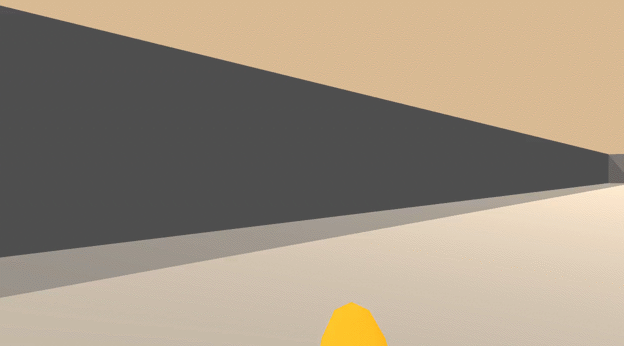
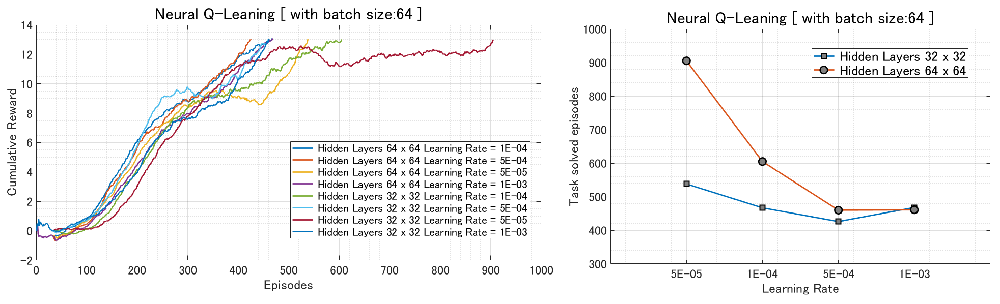

# Navigation

<p align="center">
    
</p>

## Environment setup

#### Step 1: Clone the Repository
If you haven't already, please follow the [instructions](https://github.com/dganbold/deep_reinforcement_learning) to set up your Python environment.

#### Step 2: Download the Unity Environment
Download pre-built environment for Linux from one of the [links](https://s3-us-west-1.amazonaws.com/udacity-drlnd/P1/Banana/Banana_Linux.zip).<br />
Then, place the file in the NeuralQLearning/BananaCollector/ folder in the cloned Repository, and decompress the file.<br />

```
$ cp Banana_Linux.zip NeuralQLearning/BananaCollector/
$ cd NeuralQLearning/BananaCollector/
$ unzip Banana_Linux.zip
```

Next, change the file_name parameter in train.py and test.py to match the binary file name of the Unity environment that you downloaded.
- Linux (x86): "Banana_Linux/Banana.x86"
- Linux (x86_64): "Banana_Linux/Banana.x86_64"

## State space
The state space has 37 dimensions and contains the agent's velocity, along with ray-based perception of objects around agent's forward direction.

## Action space
The simulation contains a single agent that navigates a large environment. At each time step, it has four actions at its disposal:

Num | Action        |
----|---------------|
0   | walk forward  |
1   | walk backward |
2   | turn left     |
3   | turn right    |

## Reward
A reward of +1 is provided for collecting a yellow banana, and a reward of -1 is provided for collecting a blue banana.

## Usage

- Execute the following command to train the agent:

```
$ python train.py
```

- Execute the following command to test the pre-trained agent:

```
$ python test.py
```

## Result
In this project, hyperparameter tuning procedure is divided into two parts: coarse-tuning and fine-tuning. Coarse-tuning is done by Grid-Search, result shows below.

<p align="center">
    
</p>

Environment solved in 326 episodes by [NeuralQLearner](https://github.com/dganbold/deep_reinforcement_learning/blob/master/NeuralQLearning/Agent/NeuralQLearner.py) with this set of [hyperparameter](https://github.com/dganbold/deep_reinforcement_learning/blob/master/NeuralQLearning/BananaCollector/config.py). Average Score was 13.02. [Score History](https://github.com/dganbold/deep_reinforcement_learning/blob/master/NeuralQLearning/BananaCollector/scores/NeuralQLearner_Banana_Collector_trained_426_episodes.csv).<br />
And also solved in 358 episodes by [DoubleQLearner](https://github.com/dganbold/deep_reinforcement_learning/blob/master/NeuralQLearning/Agent/NeuralQLearner.py) with same set of parameter. [Score History](https://github.com/dganbold/deep_reinforcement_learning/blob/master/NeuralQLearning/BananaCollector/scores/DoubleQLearner_Banana_Collector_trained_458_episodes.csv)


## Future work
- Implement a [Dueling Network Architectures for Deep Reinforcement Learning](https://arxiv.org/abs/1511.06581) and [Deep Quality-Value (DQV) Learning](https://arxiv.org/abs/1810.00368) with prioritized experience replay
- Apply these algorithms to environment which provided implicit observations like Atari(train agent from raw pixels)
