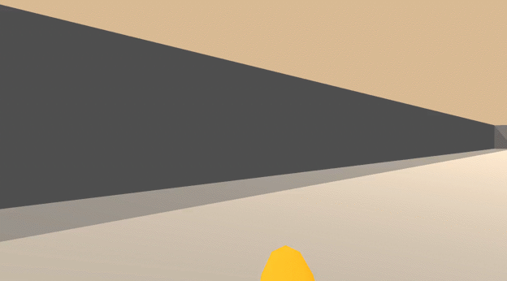
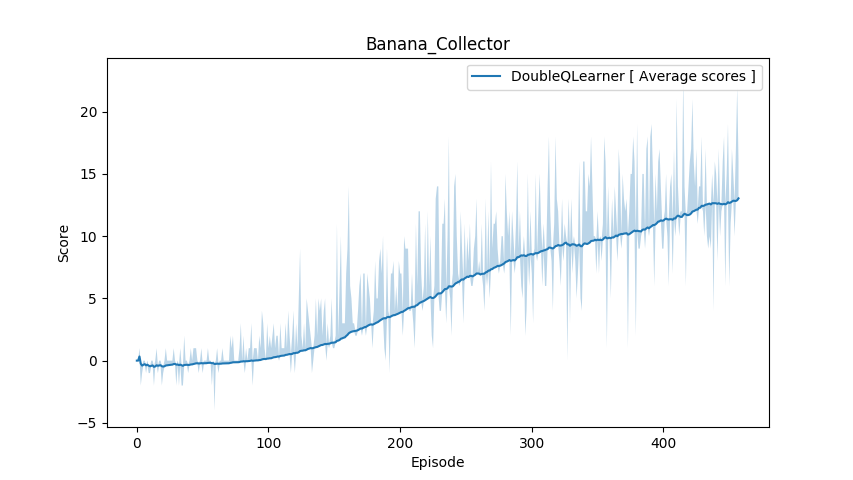
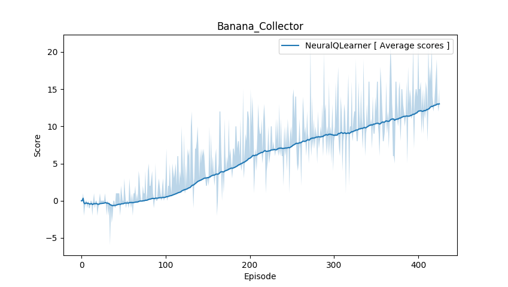

# Navigation

<p align="center">
    
</p>

## Environment setup

#### Step 1: Clone the Repository
If you haven't already, please follow the [instructions](https://github.com/dganbold/deep_reinforcement_learning) to set up your Python environment.

#### Step 2: Download the Unity Environment
Download pre-built environment from one of the links below.
- Linux: [click here](https://s3-us-west-1.amazonaws.com/udacity-drlnd/P1/Banana/Banana_Linux.zip)

Then, place the file in the NeuralQLearning/BananaCollector/ folder in the cloned Repository, and decompress the file.
Next, change the file_name parameter to match the location of the Unity environment that you downloaded.

## State space
The state space has 37 dimensions and contains the agent's velocity, along with ray-based perception of objects around agent's forward direction. 

## Action space
The simulation contains a single agent that navigates a large environment. At each time step, it has four actions at its disposal:

Num | Action        |
----|---------------|
0   | walk forward  |
1   | walk backward |
2   | turn left     |
2   | turn right    |

## Reward
A reward of +1 is provided for collecting a yellow banana, and a reward of -1 is provided for collecting a blue banana.

## Usage

- Execute the following command to train the agent:

```
$ python train.py
```

- Execute the following command to test the pre-trained agent:

```
$ python test.py
```

## Result

<p align="center">
    
</p>

<p align="center">
    
</p>
