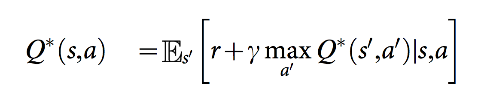
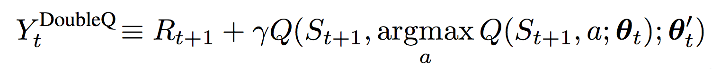

# Project 1: Navigation

<p align="center">
    
</p>

## Description
In this project, implemented popular reinforcement learning algorithms based on following papers with [PyTorch](https://www.pytorch.org/) and agent trained to navigate (and collect bananas!) in a large, square world.

- [Human-level control through deep reinforcement learning](http://www.nature.com/nature/journal/v518/n7540/full/nature14236.html)
- [Deep Reinforcement Learning with Double Q-learning](https://arxiv.org/abs/1509.06461)

## Background
Neural Q-learning use neural networks as function approximators for the action-value function Q. The architecture used here specifically takes observed states from the OpenAI gym simulator or Unity environment as input and passes these states through Multilayer perceptron(MLP or Artificial Neural Network - ANN) and produces a vector of action values (Q value for each action).

<p align="center">
    
</p>

[Human-level control through deep reinforcement learning](http://www.nature.com/nature/journal/v518/n7540/full/nature14236.html) introduced two modification to standard online Q-Learning.
First technique known as experience replay is allows for greater data efficiency. The experience replay is drawn at random from the stored agent's experiences which pooled over many episodes and to update the network. This randomization is also breaks correlations between the observations transitions(experiences). Therefore, it reduces the variance of the updates.

The second modification is to use a separate network(target Q-network) which consisting of weights at a past time step for generating the targets Q value. More precisely, every C updates clone the Q-network to obtain a target Q-network and use it for generating the Q-learning targets for the following C updates to Q-network. Q target is calculated as below.

<p align="center">
    
</p>

Standard Q-learning uses the same values both to select and to evaluate an action. This makes it more likely to select overestimated values, resulting in overoptimistic value estimates. Decoupling the selection from the evaluation is the idea behind [Deep Reinforcement Learning with Double Q-learning](https://arxiv.org/abs/1509.06461) for prevent this overestimation. In the Double Q-learning algorithm, intermediate best action is selected by gready policy from the current Q-network with next state.
The value of this policy evaluated by target Q-network. This new Q target is shown below.

<p align="center">
    
</p>

## Environment setup

#### Step 1: Clone the Repository
If you haven't already, please follow the [instructions](https://github.com/dganbold/deep_reinforcement_learning) to set up your Python environment.

#### Step 2: Download the Unity Environment
Download pre-built environment for Linux from one of the [links](https://s3-us-west-1.amazonaws.com/udacity-drlnd/P1/Banana/Banana_Linux.zip).<br />
Then, place the file in the NeuralQLearning/BananaCollector/ folder in the cloned Repository, and decompress the file.<br />

```
$ cp Banana_Linux.zip NeuralQLearning/BananaCollector/
$ cd NeuralQLearning/BananaCollector/
$ unzip Banana_Linux.zip
```

Next, change the file_name parameter in train.py and test.py to match the binary file name of the Unity environment that you downloaded.
- Linux (x86): "Banana_Linux/Banana.x86"
- Linux (x86_64): "Banana_Linux/Banana.x86_64"

## State space
The state space has 37 dimensions and contains the agent's velocity, along with ray-based perception of objects around agent's forward direction.

## Action space
The simulation contains a single agent that navigates a large environment. At each time step, it has four actions at its disposal:

Num | Action        |
----|---------------|
0   | walk forward  |
1   | walk backward |
2   | turn left     |
3   | turn right    |

## Reward
A reward of +1 is provided for collecting a yellow banana, and a reward of -1 is provided for collecting a blue banana.

## Usage

- Execute the following command to train the agent:

```
$ python train.py
```

- Execute the following command to test the pre-trained agent:

```
$ python test.py
```

## Result
The hyperparameter tuning procedure is divided into two parts: coarse-tuning and fine-tuning. Coarse-tuning is done by Grid-Search, result shows below.

<p align="center">
    
</p>

Q-Network with 64x64 hidden layers seems better than the 32x32 hidden layers. Here is the result, Q-network with 64x64 hidden layers and change batch size and learning rate.

<p align="center">
    
</p>

After some fine-tuning, environment solved in 345 episodes by [NeuralQLearner](https://github.com/dganbold/deep_reinforcement_learning/blob/master/NeuralQLearning/agent/NeuralQLearner.py) with [hyperparameters](https://github.com/dganbold/deep_reinforcement_learning/blob/master/NeuralQLearning/config/UnityML_Agent.py). [score history](https://github.com/dganbold/deep_reinforcement_learning/blob/master/NeuralQLearning/BananaCollector/scores/NeuralQLearner_Banana_Collector_batch_64_lr_4E-04_trained_445_episodes.csv).<br />
And also solved in 361 episodes by [DoubleQLearner](https://github.com/dganbold/deep_reinforcement_learning/blob/master/NeuralQLearning/agent/DoubleQLearner.py) with same set of hyperparameters. [score history](https://github.com/dganbold/deep_reinforcement_learning/blob/master/NeuralQLearning/BananaCollector/scores/DoubleQLearner_Banana_Collector_batch_64_lr_4E-04_trained_461_episodes.csv)

<p align="center">
    
</p>

## Future work
- Implement a [Noisy Networks for Exploration](https://arxiv.org/abs/1706.10295). 
One fundamental problem of Reinforcement Learning is Exploration/Exploitation dilemma. In the paper from DeepMind they propose an efficient way of tackling the above issue.

- Implement a [Dueling Network Architectures for Deep Reinforcement Learning](https://arxiv.org/abs/1511.06581) and [Deep Quality-Value (DQV) Learning](https://arxiv.org/abs/1810.00368) with prioritized experience replay.

- Try my own ideas which tackle with following issues.  
1. Sample efficiency is a one problem in DQN
2. Training takes so long, especially with deep neural network (train agent from raw pixels).<br />

The proposed algorithm is illustrated below. It based on probabilistic graphical model [Variational Auto-encoder (VAE)](https://arxiv.org/abs/1312.6114), allow us to models with 
low dimensional representation (latent variables) of observation. Training is straightforward, during exploration, train VAE part for latent modeling and passes sampled latent vector through Q-Network, compute loss and perform backpropagation in exploitation. If you have any advice or guidance, I would really appreciate it!

<p align="center">
    
</p>

- Apply these algorithms to environment which provided implicit observations like Atari(train agent from raw pixels) 
