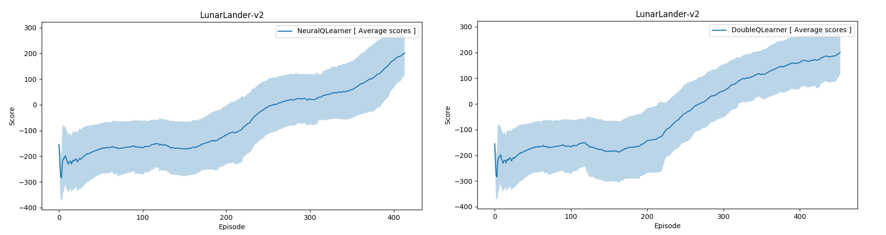

# OpenAI Gym's LunarLander-v2 environment

## Environment setup

#### Clone the Repository
If you haven't already, please follow the [instructions](https://github.com/dganbold/deep_reinforcement_learning) to set up your Python environment.

## Usage

- Execute the following command to train the agent:

```
$ python train.py
```

- Execute the following command to test the pre-trained agent:

```
$ python test.py
```

## Result
After some fine-tuning, environment solved in 314 episodes by [NeuralQLearner](https://github.com/dganbold/deep_reinforcement_learning/blob/master/NeuralQLearning/agent/NeuralQLearner.py) with [hyperparameters](https://github.com/dganbold/deep_reinforcement_learning/blob/master/NeuralQLearning/config/OpenAIGym_Box2d.py). [score history](https://github.com/dganbold/deep_reinforcement_learning/blob/master/NeuralQLearning/LunarLander/scores/NeuralQLearner_LunarLander-v2_batch_64_lr_5E-04_trained_414_episodes.csv).<br />
And also solved in 354 episodes by [DoubleQLearner](https://github.com/dganbold/deep_reinforcement_learning/blob/master/NeuralQLearning/agent/DoubleQLearner.py) with same set of hyperparameters. [score history](https://github.com/dganbold/deep_reinforcement_learning/blob/master/NeuralQLearning/LunarLander/scores/DoubleQLearner_LunarLander-v2_batch_64_lr_5E-04_trained_454_episodes.csv)

<p align="center">
    
</p>

## Future work
- Implement a [Dueling Network Architectures for Deep Reinforcement Learning](https://arxiv.org/abs/1511.06581) and [Deep Quality-Value (DQV) Learning](https://arxiv.org/abs/1810.00368) with prioritized experience replay
- Apply these algorithms to environment which provided implicit observations like Atari(train agent from raw pixels)
