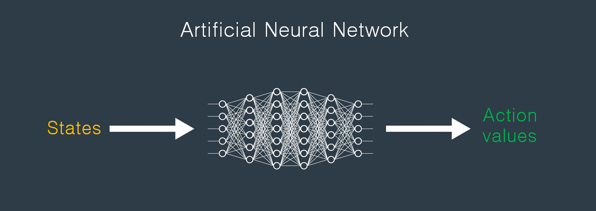
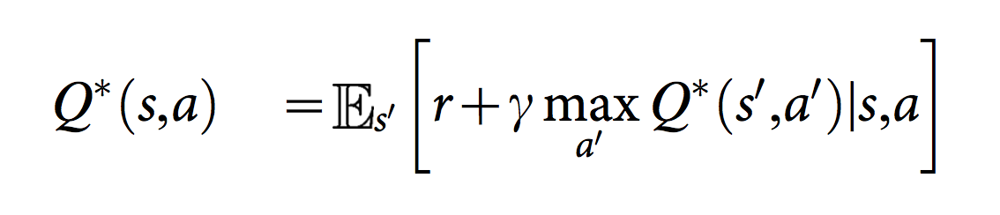
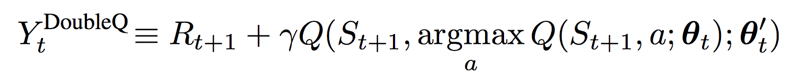

# Q-Learning with Neural Network (Neural Q-Learning)


## Description
This repository is a [PyTorch](https://www.pytorch.org/) implementation of Q-Learning with Neural Network, Double Q-learning, Dueling Network Architecture and Quality-Value Learning based on these papers.

- [Human-level control through deep reinforcement learning](http://www.nature.com/nature/journal/v518/n7540/full/nature14236.html)
- [Deep Reinforcement Learning with Double Q-learning](https://arxiv.org/abs/1509.06461)
- [Dueling Network Architectures for Deep Reinforcement Learning](https://arxiv.org/abs/1511.06581)
- [Deep Quality-Value (DQV) Learning](https://arxiv.org/abs/1810.00368)

## Background
Neural Q-learning use neural networks as function approximators for the action-value function Q. The architecture used here specifically takes observed states from the OpenAI gym simulator or Unity environment as input and passes these states through Multilayer perceptron(MLP or Artificial Neural Network - ANN) and produces a vector of action values (Q value for each action).

<p align="center">
    
</p>

[Human-level control through deep reinforcement learning](http://www.nature.com/nature/journal/v518/n7540/full/nature14236.html) introduced two modification to standard online Q-Learning.
First technique known as experience replay is allows for greater data efficiency. The experience replay is drawn at random from the stored agent's experiences which pooled over many episodes and to update the network. This randomization is also breaks correlations between the observations transitions(experiences). Therefore, it reduces the variance of the updates.

The second modification is to use a separate network(target Q-network) which consisting of weights at a past time step for generating the targets Q value. More precisely, every C updates clone the Q-network to obtain a target Q-network and use it for generating the Q-learning targets for the following C updates to Q-network. Q target is calculated as below.

<p align="center">
    
</p>

Standard Q-learning uses the same values both to select and to evaluate an action. This makes it more likely to select overestimated values, resulting in overoptimistic value estimates. Decoupling the selection from the evaluation is the idea behind [Deep Reinforcement Learning with Double Q-learning](https://arxiv.org/abs/1509.06461) for prevent this overestimation. In the Double Q-learning algorithm, intermediate best action is selected by gready policy from the current Q-network with next state.
The value of this policy evaluated by target Q-network. This new Q target is shown below.

<p align="center">
    
</p>

## Result

<p align="center">
    
</p>

## Dependencies
- [Conda](https://conda.io/docs/user-guide/install/index.html)
- Python 3.6
- [PyTorch 0.4.0](http://pytorch.org/)
- [NumPy >= 1.11.0](http://www.numpy.org/)
- [OpenAI Gym](https://github.com/openai/gym)
- [Matplotlib](https://matplotlib.org/)
- [Pandas](https://pandas.pydata.org/)
- [SciPy](https://www.scipy.org/)

If you want to run the code in this repository, check this [instructions](https://github.com/dganbold/deep_reinforcement_learning).

## Supported environments

### OpenAI Gym

#### Classic Control
  - `Acrobot-v1` with _Coming soon!_
  - `Cartpole-v0` with _Coming soon!_
  - `MountainCar-v0` with _Coming soon!_
  - `Pendulum-v0` with _Coming soon!_

#### Box2d
  - `BipedalWalker-v2` with _Coming soon!_
  - `CarRacing-v0` with _Coming soon!_
  - `LunarLander-v2` with _Coming soon!_

### Unity
- [BananaCollector](https://github.com/dganbold/deep_reinforcement_learning/tree/master/NeuralQLearning/BananaCollector)

## Usage

- Execute the following command to train the agent:

```
$ cd [Environment]
$ python train.py
```

- Execute the following command to test the pre-trained agent:

```
$ python test.py
```
