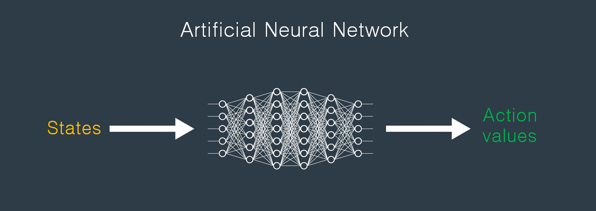
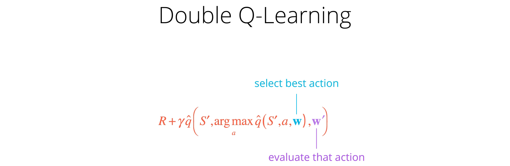

# Q-Learning with Neural Network(Neural Q-Learning) in PyTorch

## Description
This repo is a [PyTorch](https://www.pytorch.org/) implementation of Q-Learning with Neural Network, Double Q-learning, Q-Learning with Dueling Dueling Network Architecture and Quality-Value Learning based on these papers.

- [Human-level control through deep reinforcement learning](http://www.nature.com/nature/journal/v518/n7540/full/nature14236.html)
- [Deep Reinforcement Learning with Double Q-learning](https://arxiv.org/abs/1509.06461)
- [Dueling Network Architectures for Deep Reinforcement Learning](https://arxiv.org/abs/1511.06581)
- [Deep Quality-Value (DQV) Learning](https://arxiv.org/abs/1810.00368)

## Background
Neural Q-learning use neural networks as function approximators for the action-value function, Q. The architecture used here specifically takes observed states from the OpenAI gym simulator and Unity environment as input and passes these states through Multilayer perceptron(MLP or Artificial Neural Network - ANN) and produces a vector of action values (Q-value for each action).

    

[Human-level control through deep reinforcement learning](http://www.nature.com/nature/journal/v518/n7540/full/nature14236.html) introduced two modification to standard online Q-Learning.

First technique known as experience replay is allows for greater data efficiency. The experience replay is drawn at random from the stored agent's experiences which pooled over many episodes and to update the network. This randomization is also breaks correlations between the observations transitions(experiences). Therefore, it reduces the variance of the updates.

The second modification is to use a separate network(target Q network) which consisting of weights at a past time step for generating the targets Q value. More precisely, every C updates clone the main Q network to obtain a target Q network and use it for generating the Q-learning targets for the following C updates to main Q network. Q target is calculated as below.

    

The max operator in standard Q-learning, uses the same values both to select and to evaluate an action. This makes it more likely to select overestimated values, resulting in overoptimistic value estimates. Decoupling the selection from the evaluation is the idea behind Double Q-learning [Deep Reinforcement Learning with Double Q-learning](https://arxiv.org/abs/1509.06461) for prevent this overestimation. In the Double Q-learning algorithm, alternative Q target value that takes the argmax of the main Q network when inputted with the next observations. These actions, together with the next observations, are passed into the target network to yield Q values at each update. This new Q target is shown below.

    

