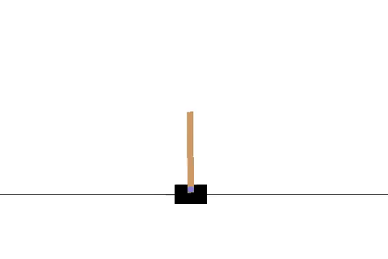
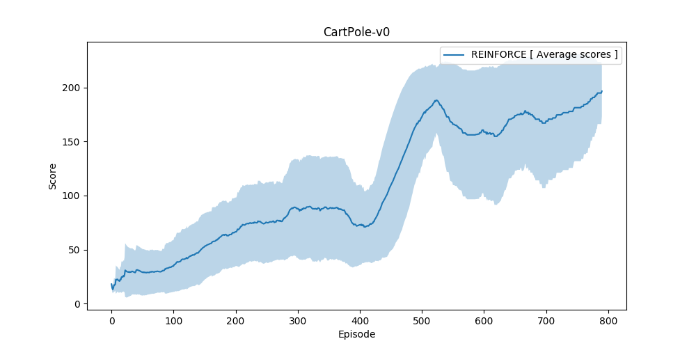

# OpenAI Gym's CartPole-v0 environment

<p align="center">
    
</p>

## Environment setup

#### Clone the Repository
If you haven't already, please follow the [instructions](https://github.com/dganbold/deep_reinforcement_learning) to set up your Python environment.

## Usage

- Execute the following command to train the agent:

```
$ python train.py
```

- Execute the following command to test the pre-trained agent:

```
$ python test.py
```

## Result
After some hyperparameter tuning, environment solved in 691 episodes by [REINFORCE](https://github.com/dganbold/deep_reinforcement_learning/blob/master/REINFORCE/agent/REINFORCE.py) with [hyperparameters](https://github.com/dganbold/deep_reinforcement_learning/blob/master/REINFORCE/config/OpenAIGym_ClassicControl.py). [score history](https://github.com/dganbold/deep_reinforcement_learning/blob/master/REINFORCE/CartPole/scores/CartPole-v0_REINFORCE_1.0E-02_16_0.0E+00_128.csv).<br />

<p align="center">
    
</p>
